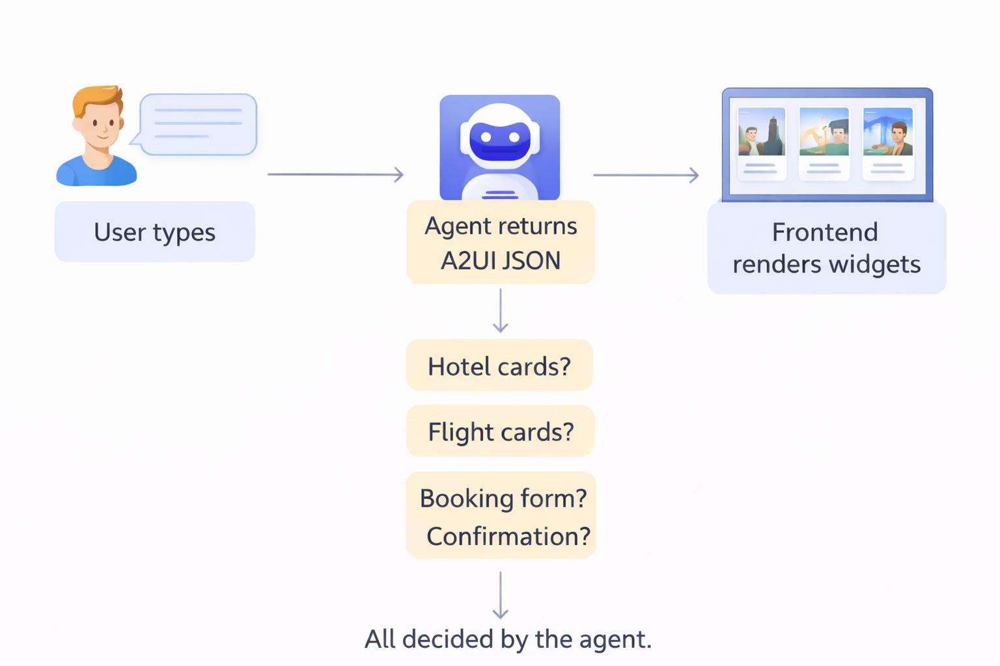
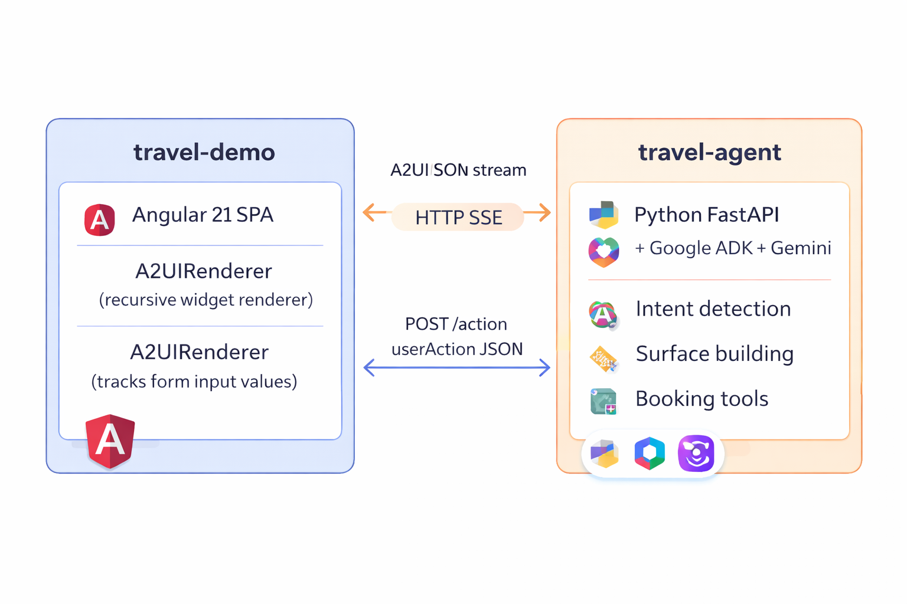

# Travel Agent Demo — A2UI + Google ADK

A working end-to-end demo of A2UI (Agent-to-UI) showing how an AI agent can drive a rich chat UI entirely through A2UI JSON Payload powered by A2UI, Google ADK and Gemini model. The agent never returns plain text — every response is a structured UI surface that the frontend renders dynamically.


## What This Demo Shows

Traditional AI chat apps return markdown or plain text that the frontend displays verbatim. This demo inverts that: the **agent decides what UI to show**, and the frontend is a dumb renderer that executes those instructions.

When you type "Search hotels in Paris", the agent responds with a JSON payload describing hotel cards, images, prices, and "Book Hotel" buttons. The frontend renders exactly those widgets — no hardcoded templates, no frontend routing logic.

This pattern is called **Agent-to-UI (A2UI)**. It lets an AI agent control the entire user experience from the backend.



## Architecture



**Search actions** (hotel search, flight search) are handled deterministically — no LLM involved. Results come from in-memory data.

**Booking actions** go through Gemini, which calls `book_trip()` and returns a confirmation surface.

---

## Apps

### `travel-agent/` — Backend (Python + Google ADK)

| | |
|---|---|
| Language | Python 3.11+ |
| Framework | FastAPI with SSE streaming |
| AI | Google ADK + Gemini 2.0 Flash |
| Pattern | Agent streams A2UI JSON over Server-Sent Events |
| Port | `8000` |

Key files:
- `app/main.py` — FastAPI app, surface builders, `/action` endpoint
- `app/agent.py` — ADK agent with A2UI response templates
- `app/tools.py` — `search_hotels`, `search_flights`, `book_trip` tools + hotel/flight data
- `app/config.py` — Settings loaded from `.env`

### `travel-demo/` — Frontend (Angular 21)

| | |
|---|---|
| Language | TypeScript 5.x |
| Framework | Angular 21 (zoneless, signals) |
| Styling | TailwindCSS v4 + DaisyUI v5 |
| Pattern | Recursive A2UI renderer component |
| Port | `4200` |

Key files:
- `src/app/features/travel-chat/components/a2ui-renderer/` — Recursive widget renderer
- `src/app/features/travel-chat/services/travel-agent.service.ts` — SSE client, surface state
- `src/app/features/travel-chat/components/chat-page/` — Chat layout + message list

---

## Supported Destinations

**Hotels:**

| City | Options | Price range |
|------|---------|-------------|
| Paris | Le Meurice, des Grands Boulevards, Generator Paris | $85 – $450/night |
| Tokyo | Park Hyatt, Shinjuku Granbell, Khaosan Kabuki | $60 – $520/night |
| London | The Savoy, citizenM Shoreditch, Generator London | $75 – $580/night |
| New York | The Plaza, citizenM Bowery, HI NYC Hostel | $65 – $680/night |

**Flights** (from JFK unless noted):

| Destination | Airlines | Price range |
|-------------|----------|-------------|
| Paris | Air France, British Airways | $540 – $620 |
| Tokyo | Japan Airlines, ANA | $870 – $980 |
| London | British Airways, Virgin Atlantic | $490 – $580 |
| New York | Delta, American Airlines (from LAX) | $280 – $320 |

---

## Prerequisites

- **Python 3.11+** with `pip` or a virtual environment
- **Node.js 18+** and `npm`
- **Google API key** with Gemini access — get one at [aistudio.google.com](https://aistudio.google.com)

---

## Quick Start

### Step 1 — Configure API key

```bash
# In demo/travel-agent/
cp .env.example .env   # if example exists, otherwise create:
echo "GOOGLE_API_KEY=your-key-here" > demo/travel-agent/.env
```

### Step 2 — Start the backend

```bash
cd demo/travel-agent

# Create and activate virtual environment
python3 -m venv .venv
source .venv/bin/activate          # Windows: .venv\Scripts\activate

# Install dependencies
pip install -e .

# Start server
uvicorn app.main:app --host 0.0.0.0 --port 8000
```

Expected output:
```
INFO:     Uvicorn running on http://0.0.0.0:8000
INFO:     Application startup complete.
```

Verify: `curl http://localhost:8000/health` should return `{"status":"ok"}`

### Step 3 — Start the frontend

Open a new terminal:

```bash
cd demo/travel-demo

npm install
npm start
```

Expected output:
```
Application bundle generation complete.
Local:   http://localhost:4200/
```

### Step 4 — Open the app

Navigate to **http://localhost:4200**

You should see a centered search bar with the TravelAI header and suggestion chips.

---

## Testing — Hotels

### Test 1: Search hotels in Paris

**Input:** Type in the search bar:
```
Search for hotels in Paris
```

**Expected:** A hotel search form appears with:
- Destination field pre-filled or empty
- Nights input
- Search button

Fill in:
- Destination: `Paris`
- Nights: `3`

Click **Search Hotels**.

**Expected result** (after ~5–10 seconds):

```
+----------------------------------+
| Hotel Le Meurice        5 stars  |
| $450/night · $1,350 total        |
| Spa · Fine Dining · Concierge    |
| [Book Hotel]                     |
+----------------------------------+
| Hotel des Grands Boulevards 4*   |
| $220/night · $660 total          |
| Bar · Terrace · Free WiFi        |
| [Book Hotel]                     |
+----------------------------------+
| Generator Paris         3 stars  |
| $85/night · $255 total           |
| Free WiFi · Bar · Lounge         |
| [Book Hotel]                     |
+----------------------------------+
```

No flight cards or flight section should appear.

---

### Test 2: Book a hotel

From the hotel results, click **Book Hotel** on any card.

**Expected confirmation** (after ~5–10 seconds):

```
Booking Confirmed!
Ref: TRV-XXXXXX

🏨 Hotel Le Meurice · 3 nights
Booking confirmed! Your hotel is reserved.
```

No airline, flight route, or departure/arrival times should appear.

---

### Test 3: Search hotels in other cities

Try these inputs to test other destinations:
- `Search for hotels in Tokyo`
- `Search for hotels in London`
- `Search for hotels in New York`

Each should return 3 hotel cards specific to that city.

---

## Testing — Flights

### Test 4: Search flights to Paris

**Input:**
```
Find flights to Paris
```

**Expected:** A flight search form appears. Fill in:
- From: `New York`
- To: `Paris`
- Date: any future date (e.g. `2025-06-15`)

Click **Search Flights**.

**Expected result:**

```
+------------------------------------------+
| Air France                               |
| JFK 09:00 -> CDG 22:30 · 7h 30m         |
| $620/person                              |
| [Book Air France]                        |
+------------------------------------------+
| British Airways                          |
| JFK 18:00 -> CDG 08:15+1 · 8h 15m       |
| $540/person                              |
| [Book British Airways]                   |
+------------------------------------------+
```

---

### Test 5: Book a flight

Click **Book Air France** (or Book British Airways).

**Expected confirmation:**

```
Flight Booked!
Ref: TRV-XXXXXX

Air France · JFK 09:00 -> CDG 22:30 · 7h 30m
Your flight is confirmed.
```

No hotel name or nightly rate should appear.

---

## Quick Test Reference

| What to type | Form to fill | Expected result |
|---|---|---|
| `Search for hotels in Paris` | Destination: Paris, Nights: 3 | 3 hotel cards (Le Meurice, des Grands Boulevards, Generator) |
| `Search for hotels in Tokyo` | Destination: Tokyo, Nights: 2 | 3 hotel cards (Park Hyatt, Shinjuku Granbell, Khaosan) |
| `Search for hotels in London` | Destination: London, Nights: 1 | 3 hotel cards (The Savoy, citizenM, Generator) |
| `Find flights to Paris` | From: New York, To: Paris | 2 flight cards (Air France, British Airways) |
| `Find flights to Tokyo` | From: New York, To: Tokyo | 2 flight cards (Japan Airlines, ANA) |
| `Find flights to London` | From: New York, To: London | 2 flight cards (British Airways, Virgin Atlantic) |
| Click Book Hotel | — | Hotel-only confirmation, no flight info |
| Click Book Flight | — | Flight-only confirmation, no hotel info |

---

## Troubleshooting

**Backend won't start — `GOOGLE_API_KEY` error**
Make sure `.env` exists in `demo/travel-agent/` with `GOOGLE_API_KEY=your-key`. The app calls `load_dotenv()` on startup.

**No results after searching**
The agent takes 5–15 seconds to respond (Gemini API call). Wait before assuming it failed.

**Styles look unstyled / plain HTML buttons**
TailwindCSS or DaisyUI is not loaded. Run `npm install` in `demo/travel-demo/` and restart.

**Empty chat bubble with no content**
The Gemini API returned an empty response. Try the same query again — this is transient.

**CORS error in browser console**
The backend must be running on port `8000`. Check `http://localhost:8000/health` returns `{"status":"ok"}`.
